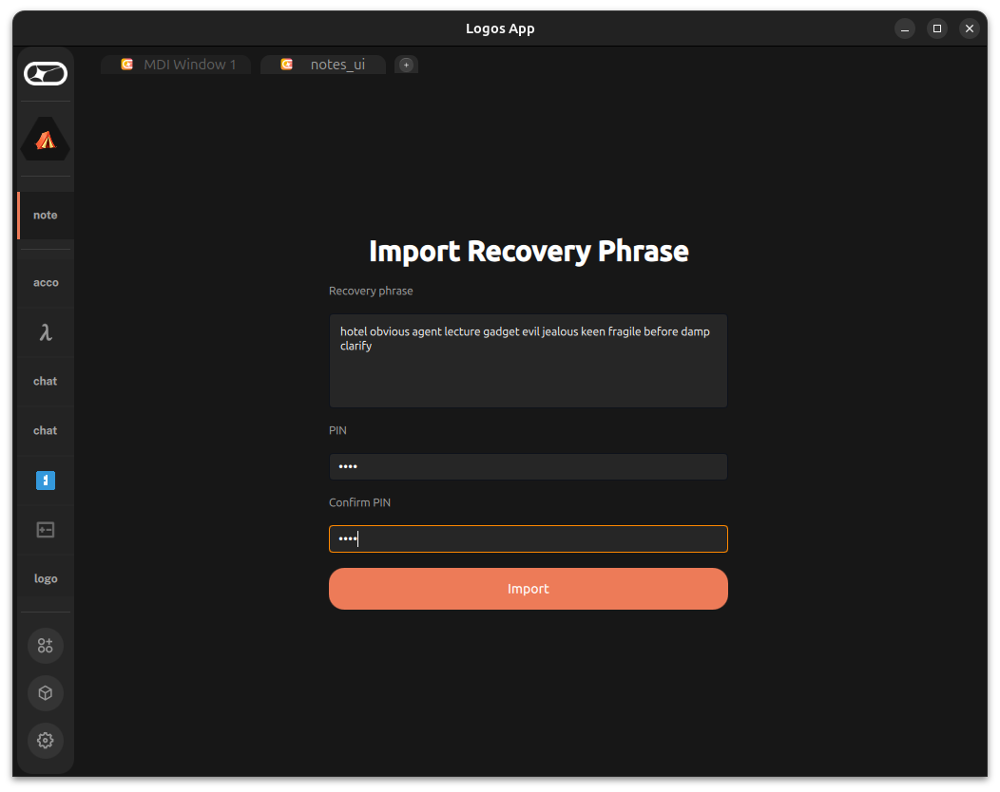
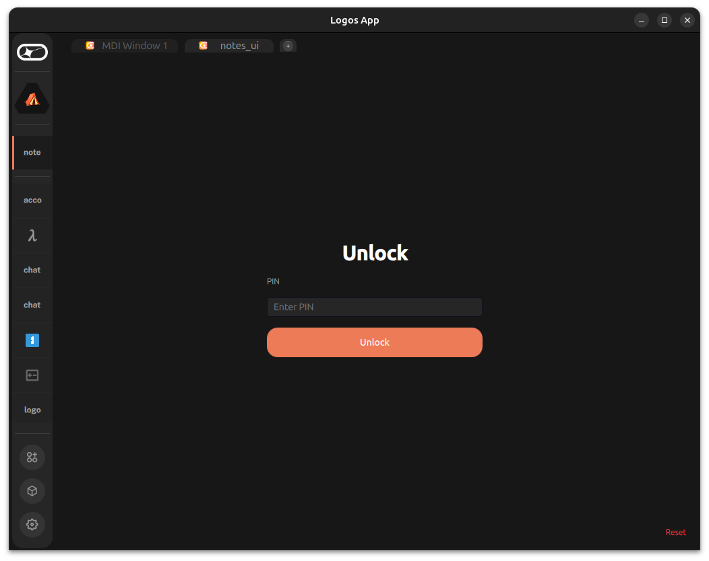
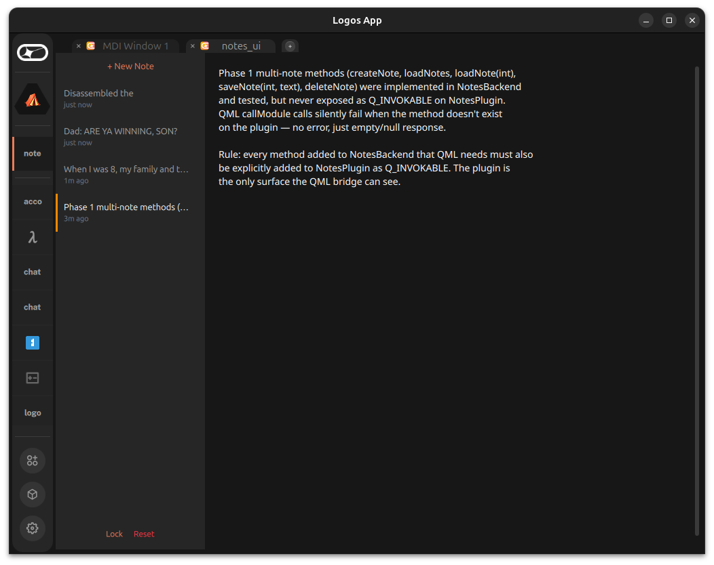

# logos-notes

Encrypted, local-first notes app for the [Logos](https://logos.co) ecosystem.

Built as a Qt6/QML desktop application targeting the Logos App (Basecamp) module host. Phase 0 ships as a standalone app; later phases integrate with Logos Messaging and Logos Storage.

**Approved idea & detailed roadmap**: [logos-co/ideas#13](https://github.com/logos-co/ideas/issues/13)

---

## What it does

- **Multiple encrypted notes** with a sidebar for navigation
- Enter a BIP39 recovery phrase once to derive your encryption key
- **Full BIP39 validation** — wordlist membership, checksum verification, NFKD normalization
- Set a PIN (min 6 characters) that protects access across sessions — the mnemonic is never stored
- **PIN brute-force protection** — 5 attempts, then exponential lockout (30s → 600s) with live countdown
- Create, edit, and delete notes — each is AES-256-GCM encrypted before hitting disk
- **Encrypted note titles** — even metadata never touches disk as plaintext
- Auto-save per note on a 1.5s timer
- Sidebar shows decrypted note title (first line) and relative timestamp
- Lock/unlock flow wipes the master key from memory on lock
- **Secure key zeroization** — temporary key buffers wiped via `sodium_memzero` after use
- Single encrypted SQLite database — no plaintext on disk

No accounts, no servers, no plaintext on disk.

---
## Phase 0 Screencast
https://github.com/user-attachments/assets/59ef5b7b-d02e-4a77-97e0-a629ba17ec28

---
## Screenshots

Running inside [Logos App](https://github.com/logos-co/logos-app-poc) (Basecamp):

| Import | Unlock |
|--------|--------|
|  |  |

| Multi-note sidebar (Phase 1) |
|-------------------------------|
|  |

---

## Security model

Your recovery phrase is the root of everything. When you first import it, the app derives a master encryption key from it using Argon2id with a random persisted salt, then forgets the phrase entirely. It is never written to disk, never stored in a database, never logged. The recovery phrase is fully validated against the BIP39 English wordlist with checksum verification — invalid phrases are rejected before any key derivation occurs. If you lose your recovery phrase, there is no way to recover your notes on a new device.

The PIN exists to protect day-to-day access. During import, the app encrypts your master key with a key derived from your PIN (Argon2id, OPSLIMIT_MODERATE) and stores that encrypted bundle in the local database. On every subsequent launch, you enter your PIN to unwrap the master key back into memory. A wrong PIN fails the AES-256-GCM authentication tag check. After 5 failed attempts, the app enforces exponential lockout (30s, 60s, 120s, 5m, 10m) with a live countdown timer. The lockout counter persists across app restarts.

When you lock the app, the master key is wiped from memory immediately via `sodium_memzero`. Temporary key buffers (PIN-derived keys, intermediate derived keys) are wrapped in a SecureBuffer RAII class that zeroizes on destruction. Nothing sensitive lives in memory while the app is locked.

An attacker with access to your device would find only encrypted blobs in the SQLite database — both note content and note titles are encrypted. To read your notes, they would need your PIN to unwrap the master key, or your original recovery phrase to re-derive it. Without either, the AES-256-GCM ciphertext is computationally infeasible to break.

See [SECURITY_REVIEW.md](SECURITY_REVIEW.md) for the full security audit and known limitations.

---

## Encryption

```
BIP39 mnemonic
    └─ Argon2id (random persisted salt, OPSLIMIT_MODERATE)
           └─ 256-bit master key  (never stored)

PIN
    └─ Argon2id (random salt, OPSLIMIT_MODERATE, stored in DB)
           └─ 256-bit wrapping key
                  └─ AES-256-GCM(master key)  → stored in DB

Note content + title
    └─ AES-256-GCM(plaintext, master key, random nonce)  → stored in DB
```

Wrong PIN → GCM authentication tag fails → access denied.
The mnemonic is only entered once (import). All subsequent unlocks use the PIN alone.

---

## Screens

| Screen | Shown when |
|--------|-----------|
| **Import** | First launch — enter recovery phrase + set PIN (min 6 chars) |
| **Unlock** | Every subsequent launch — enter PIN (with lockout countdown on failure) |
| **Notes** | After unlock — sidebar with note list + auto-saving editor |

---

## Tech stack

| Component | Technology |
|-----------|-----------|
| Language | C++17 |
| UI | Qt 6.9.3 / QML / QtQuick Controls |
| Crypto | libsodium 1.0.18 (AES-256-GCM, Argon2id) |
| Storage | SQLite via Qt SQL |
| Build | CMake 3.28 + Ninja |
| Nix | flake.nix for reproducible builds and dev shell |

---

## Building

### Prerequisites

- Qt 6.6+ (tested with 6.9.3) — install via Qt online installer or system packages
- `libsodium-dev`, `cmake`, `ninja-build`, `pkg-config`

```bash
# Ubuntu
sudo apt install libsodium-dev cmake ninja-build pkg-config
```

### Configure and build

```bash
cmake -B build -G Ninja \
  -DCMAKE_PREFIX_PATH=~/Qt/6.9.3/gcc_64 \
  -DCMAKE_BUILD_TYPE=Debug

cmake --build build
```

### Run tests

```bash
./build/test_multi_note    # 9 tests — multi-note CRUD
./build/test_security      # 14 tests — BIP39, salt, PIN brute-force
```

### Run standalone

```bash
./build/logos-notes
```

### Install as Logos App module

```bash
cmake --install build
```

This installs:
- `notes_plugin.so` → `~/.local/share/Logos/LogosApp/modules/notes/`
- `notes_ui` QML plugin → `~/.local/share/Logos/LogosApp/plugins/notes_ui/`

Then launch the Logos App and click **Load** on `notes_ui` in the UI Modules tab.

### Nix dev shell

```bash
nix develop   # drops into a shell with Qt6, libsodium, cmake, ninja, clangd
```

---

## Project structure

```
logos-notes/
├── CMakeLists.txt
├── flake.nix
├── SECURITY_REVIEW.md                # Security audit + known limitations
├── modules/notes/manifest.json        # Core module manifest
├── plugins/notes_ui/
│   ├── manifest.json                  # UI plugin manifest
│   ├── metadata.json                  # QML plugin metadata
│   └── Main.qml                      # Module UI (all 3 screens)
├── scripts/
│   └── security-review-loop.sh        # Diff → Codex security review
└── src/
    ├── main.cpp                       # Standalone app entry point
    ├── core/
    │   ├── Bip39Wordlist.h            # Embedded 2048-word BIP39 English wordlist
    │   ├── CryptoManager.h/cpp        # AES-256-GCM + Argon2id (libsodium)
    │   ├── DatabaseManager.h/cpp      # SQLite: notes, wrapped_key, meta
    │   ├── KeyManager.h/cpp           # BIP39 validation + checksum, key lifecycle
    │   ├── NotesBackend.h/cpp         # Screen navigation, note persistence, PIN lockout
    │   └── SecureBuffer.h             # RAII key zeroization wrapper
    ├── plugin/
    │   ├── NotesPlugin.h/cpp          # PluginInterface for Logos App
    │   └── plugin_metadata.json       # Embedded Qt plugin metadata
    └── ui/
        ├── main.qml
        ├── screens/
        │   ├── ImportScreen.qml
        │   ├── UnlockScreen.qml       # Live lockout countdown timer
        │   └── NoteScreen.qml
        └── components/
            └── PinInput.qml
```

---

## Roadmap

| Phase | Goal | Status |
|-------|------|--------|
| **0** | Standalone encrypted notes app + Logos App module | ✅ Complete |
| **1** | Multiple notes with sidebar UI, CRUD, auto-save | ✅ Complete |
| **Security** | P0+P1+P2 hardening: BIP39 validation, random salt, PIN lockout, encrypted titles, SecureBuffer, AES-NI check, SQLite hardening | ✅ Complete |
| **2** | Swap Argon2 key derivation → Keycard hardware key (same PIN UX, same DB schema) | Planned |
| **3** | Logos Storage backup + Logos Messaging sync across devices | Planned |

### Distribution targets

Same core app, different packaging — parallel tracks, not sequential.

| Target | Version | Description | Status |
|--------|---------|-------------|--------|
| **AppImage** | v0.4.0 | Standalone desktop app, runs without Logos App | Planned |
| **LGX package** | v0.5.0 | Installs inside Logos App via Package Manager | Planned |

### Security issues tracker

| Issue | Severity | Status |
|-------|----------|--------|
| [#3](../../issues/3) BIP39 wordlist validation + checksum | P0 | ✅ Fixed |
| [#4](../../issues/4) Random persisted salt | P0 | ✅ Fixed |
| [#2](../../issues/2) PIN brute-force protection | P0 | ✅ Fixed |
| [#5](../../issues/5) Encrypt note titles | P1 | ✅ Fixed |
| [#6](../../issues/6) Zeroize key buffers | P1 | ✅ Fixed |
| [#10](../../issues/10) PIN lockout integrity | P1 | ⚠️ Documented limitation |
| [#11](../../issues/11) saveMeta() error handling | P2 | ✅ Fixed |
| [#7](../../issues/7) AES-NI fail-fast check | P1 | ✅ Fixed |
| [#8](../../issues/8) AEAD nonce validation | P2 | ✅ Partial (nonce check done, AAD open) |
| [#9](../../issues/9) SQLite hardening | P2 | ✅ Fixed |

See [SECURITY_REVIEW.md](SECURITY_REVIEW.md) for full audit details.

See [logos-co/ideas#13](https://github.com/logos-co/ideas/issues/13) for the detailed roadmap and phase definitions.

---

## Related repositories

| Repo | Purpose |
|------|---------|
| [logos-app-poc](https://github.com/logos-co/logos-app-poc) | Shell host that loads this module |
| [logos-chat-ui](https://github.com/logos-co/logos-chat-ui) | Reference dapp (same C++/QML pattern) |
| [logos-cpp-sdk](https://github.com/logos-co/logos-cpp-sdk) | C++ SDK for Logos modules |
| [logos-docs](https://github.com/logos-co/logos-docs) | Ecosystem documentation |
