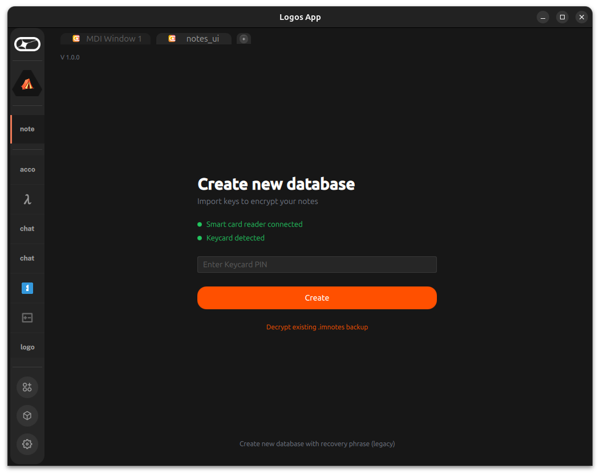
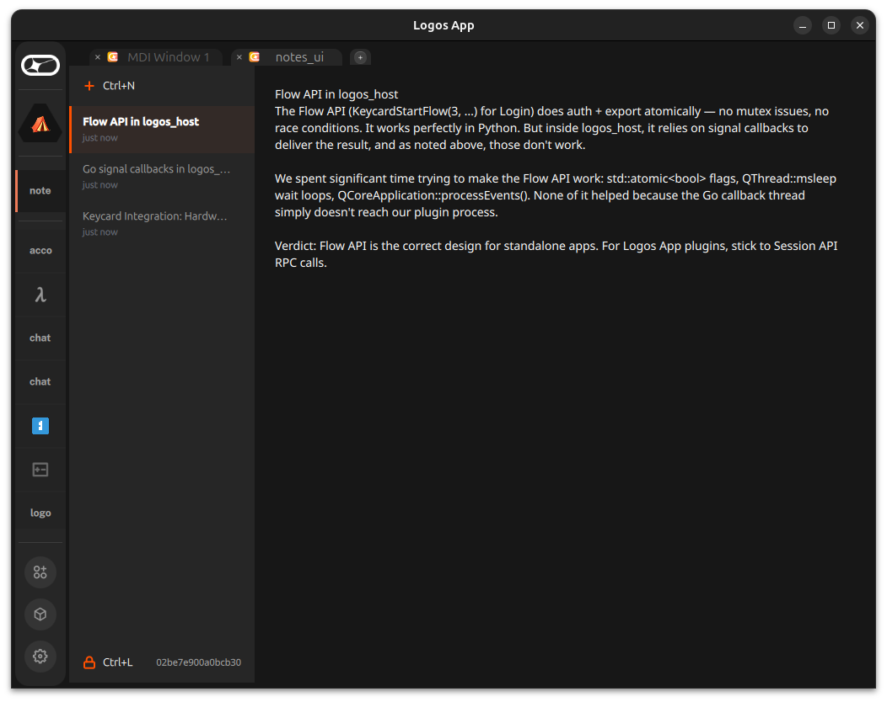
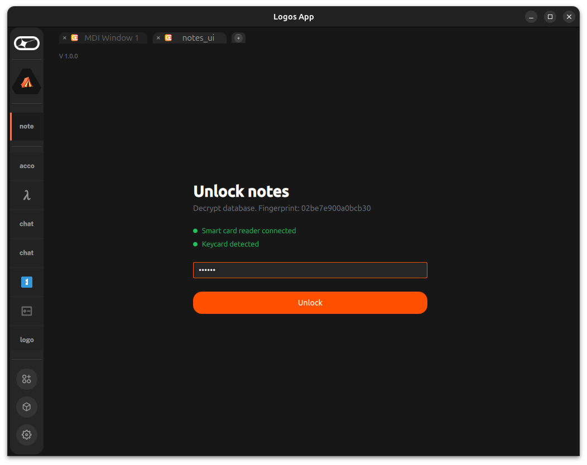
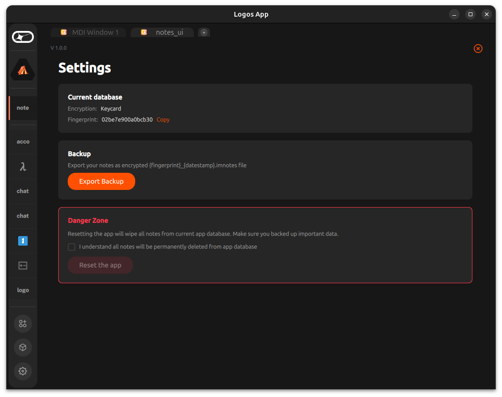

# Building Immutable Notes on Logos

*Originally drafted March 15, 2026. Updated March 17 with v1.0.0 Keycard release.*

*Note: We submitted this post to Logos Press Engine before v0.6.0. By the time it's published, the app shipped Keycard hardware key derivation, a full UI redesign, and went through live demos with real community reactions. We ship faster than we write about it — consider this a snapshot of the journey, not the destination.*

## Why This Should Exist on Logos

Most note-taking apps are surveillance by default. Your thoughts live on someone else's server, readable by the company, accessible to governments, vulnerable to breaches. Even "encrypted" apps often hold the keys themselves.

Logos is built around a different premise entirely. No central servers. No company holding your keys. No permission required to participate. A notes app on Logos is an act of thought sovereignty. Your notes exist only for you, encrypted by a key that only you hold, with no intermediary ever seeing the plaintext.

But the bigger idea is what this shows for the ecosystem. **Any Logos app can be unlocked by a Keycard.** Notes, wallet, chat — one card, one PIN, keys never leave the chip. Pull it out and the session ends. No passwords, no keys on disk. This is what hardware means for the ecosystem.

The full vision is an encrypted notes manager with Keycard hardware key protection and sync across devices via Logos Messaging and Logos Storage. No accounts. No servers. Your Keycard is your identity.

More about the idea and all development phases is [here](https://github.com/logos-co/ideas/issues/13).

I started building this on March 12. Five days and seven versions later, it has Keycard hardware encryption, multi-note support, a two-AI security audit, encrypted backups, and runs inside Logos App with a live demo getting real reactions from the community.

| Create with Keycard | Note editor |
|---------------------|-------------|
|  |  |

---

## The Journey: v0.1.0 to v1.0.0 in Five Days

| Version | What shipped | Days in |
|---------|-------------|---------|
| v0.1.0 | Single encrypted note, Logos App module | Day 1 |
| v0.2.0 | Multiple notes, sidebar | Day 1 |
| v0.3.0 | Security hardening (BIP39, salt, PIN lockout) | Day 2 |
| v0.4.0 | P2 security, AES-NI fail-fast | Day 2 |
| v0.5.0 | Settings, backup, stable identity | Day 3 |
| v0.6.0 | LGX packaging, 95-case test suite | Day 3 |
| **v1.0.0** | **Keycard hardware key derivation + UI polish** | **Day 5** |

For building and research I used Claude Code. The collaboration felt like a hackathon — I brought the roadmap, the UX direction, and the architectural decisions. Claude Code brought speed and the ability to read fifty source files and write correct C++ in the time it takes to make coffee. For security review I used a two-AI loop — Claude writes code, Codex reviews the diffs. More on that below.

---

## What It Does Today (v1.0.0)

### Keycard-first encryption

Plug in a USB smart card reader. Insert your Status Keycard. Enter your PIN. Done. Your notes are encrypted with a key derived from the card's hardware — a secp256k1 private key at the EIP-1581 encryption path, domain-separated into a 256-bit AES-256-GCM key.

The card must be present every time you unlock. Pull it out — session locks instantly. Insert a different card — "Wrong keys. Try different Keycard."

Recovery phrase import still works as a legacy option — one link at the bottom of the screen.

### Honest UI

We obsessed over the copy. Every label tells you exactly what's happening:

- **"Create new database"** — not "Sign up" or "Create account"
- **"Unlock notes"** — not "Login"
- **"Decrypt database. Fingerprint: ..."** — tells you what the PIN does and whose data you're unlocking
- **"Reset the app"** — not "Delete account" (there is no account)

Two-line status indicators show reader and card state with colored dots. Green means connected. Gray with a slow blink means searching. Red means error. No ambiguity.

| Unlock notes | Settings |
|--------------|----------|
|  |  |

### Everything else

- **Multiple encrypted notes** with sidebar, auto-save, Ctrl+N/Ctrl+L shortcuts
- **Encrypted titles** — even metadata never touches disk as plaintext
- **Encrypted backup/restore** — `.imnotes` files, portable across devices
- **95+ test cases** across 6 test suites
- **PIN brute-force protection** — 5 attempts, exponential lockout

---

## The Crypto Architecture

One principle: **nothing sensitive ever touches disk in plaintext.**

```
Keycard (v1.0.0):
    secp256k1 key at m/43'/60'/1581'/1'/0
        → SHA256(key || "logos-notes-encryption")   [domain separation]
            → 256-bit AES-256-GCM master key

Recovery Phrase (legacy):
    BIP39 mnemonic → Argon2id (random salt) → 256-bit master key
    PIN → Argon2id → wrapping key → AES-256-GCM(master key) → stored in DB

Note content + title:
    → AES-256-GCM(plaintext, master key, random nonce) → stored in DB
```

Domain separation ensures different apps derive different keys from the same Keycard. If Logos Wallet uses the same card, it gets a different key. Same card, same PIN, completely isolated encryption domains.

All temporary key material is wrapped in a [SecureBuffer](https://github.com/xAlisher/logos-notes/blob/master/src/core/SecureBuffer.h) RAII class that calls `sodium_memzero` on destruction.

---

## How Logos App Modules Work

The Logos App is a microkernel that loads modules dynamically:

| Type | Mechanism | Use case |
|------|-----------|----------|
| `core` | C++ `.so` implementing `PluginInterface` | Backend logic, crypto, storage |
| `ui_qml` | Plain `.qml` file, no C++ needed | UI via `logos.callModule()` bridge |

We built two modules:
- `notes` (core) — C++ backend with Keycard bridge, crypto, SQLite
- `notes_ui` (ui_qml) — single QML file with all screens

The QML bridge is synchronous: `logos.callModule("notes", "method", [args])` returns a JSON string. For notes, everything is user-initiated, so this is sufficient.

---

## Lessons for Other Builders

Five days of building taught me more about the Logos platform than any documentation could.

### The plugin surface rule

`NotesPlugin` is the **only** surface QML can see. If you add a method to your backend but don't expose it as `Q_INVOKABLE` on the plugin class, `logos.callModule` silently returns null. No error. You'll spend an hour debugging a typo.

### The sandbox is real

`ui_qml` plugins run sandboxed. `FileDialog` does nothing. `import Logos.Theme` fails silently. Hardcode your palette, move file I/O to C++, build custom controls.

### Go shared libraries work, but callbacks don't

We wrap `status-keycard-go` as `libkeycard.so` via CGO. RPC calls work perfectly inside the Logos App plugin host. But Go signal callbacks (push notifications from goroutines) never fire — the Go thread can't reach the Qt plugin process. Use RPC polling instead. Full technical details in the [Keycard integration blog post](2026-03-17-keycard-integration.md).

### Kill everything between tests

Logos App spawns `logos_host` child processes per module. They survive the parent being killed and hold stale `.so` files. AppImage wraps processes via `ld-linux`, so `pkill -f logos` misses them. Kill by `.elf` binary name.

### Always test in both environments

Standalone testing covers about 60% of bugs. The other 40% only appear inside Logos App — different QML engine, different library paths, different available components.

---

## The Two-AI Security Review

After shipping the core features, I ran a full security audit using two AI systems against each other. Claude Code (Opus) wrote the fixes. OpenAI Codex reviewed the diffs.

This caught real bugs. The most serious: a cipher fallback (AES-GCM to XChaCha20) that wasn't persisted with the encrypted data — move your DB to a different machine and your notes become unreadable. Codex flagged it as High severity. We stripped the fallback entirely.

The same loop ran for Keycard integration: every branch got pushed, Codex reviewed, findings addressed, re-reviewed until LGTM. Four rounds on the Keycard branch alone — catching things like wrong-card acceptance at unlock and incomplete install artifacts.

Four review rounds per feature, dozens of findings, all resolved. Full audit in [SECURITY_REVIEW.md](https://github.com/xAlisher/logos-notes/blob/master/SECURITY_REVIEW.md).

---

## What's Next

**v1.1.0 — Shared Keycard module.** This is the real payoff. Extract `KeycardBridge` into a standalone ecosystem module. Wallet, chat, notes, any future Logos app — one card, one PIN, all unlocked. The card becomes your identity across the entire platform. No passwords anywhere. Pure hardware.

**Trust Network.** Encrypted backup with redundancy through trusted peers. Export to Logos Storage, broadcast CID via Waku to peers who opted in. Reciprocal by design.

**Card initialization wizard.** Set up a blank Keycard from within the app — currently requires Keycard Shell or Status Desktop.

---

## Try It

```bash
git clone https://github.com/xAlisher/logos-notes
cd logos-notes
./scripts/build-libkeycard.sh              # Build Keycard library
cmake -B build -G Ninja -DCMAKE_PREFIX_PATH=~/Qt/6.9.3/gcc_64
cmake --build build -j4 && cmake --install build
```

Seven versions. 95 tests. Six blog posts. Zero plaintext on disk. One Keycard.

Clone it, break it, build on top of it. Find me on [Status](https://status.app/u/CwmAChEKD0FsaXNoZXIgU2hlcmFsaQM=#zQ3shWBWbQjMhpevjRT3KifqunFR8F81hbwzRMs7193PgWrhf) or in the Logos Discord.

[github.com/xAlisher/logos-notes](https://github.com/xAlisher/logos-notes)

---

*"We must defend our own privacy if we expect to have any."*
— Eric Hughes, A Cypherpunk's Manifesto, 1993
